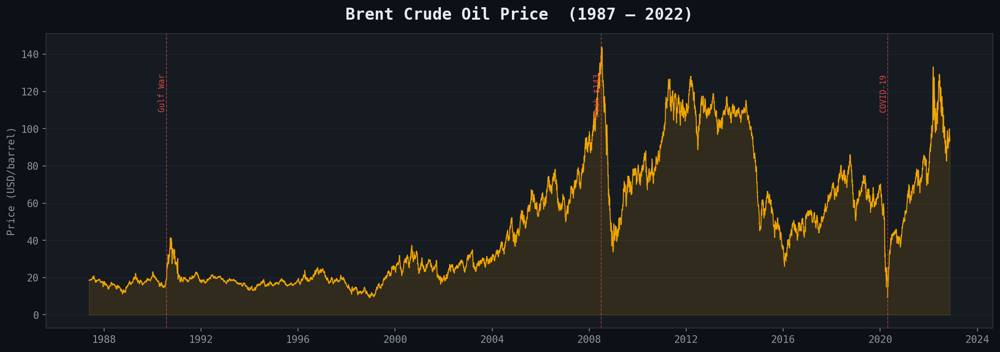
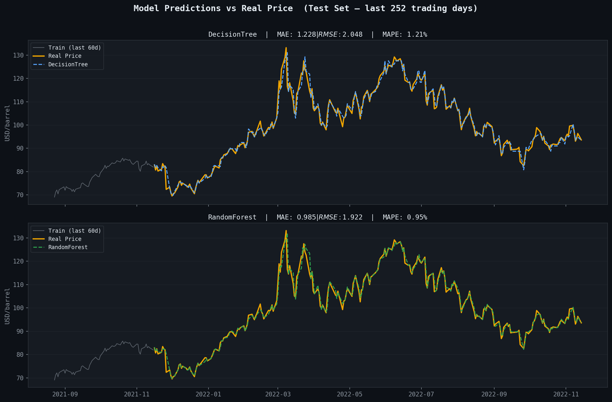
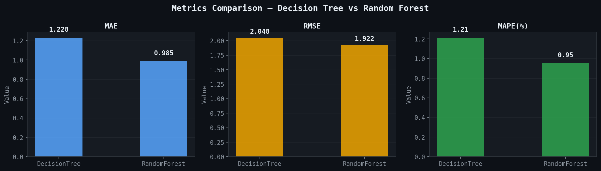
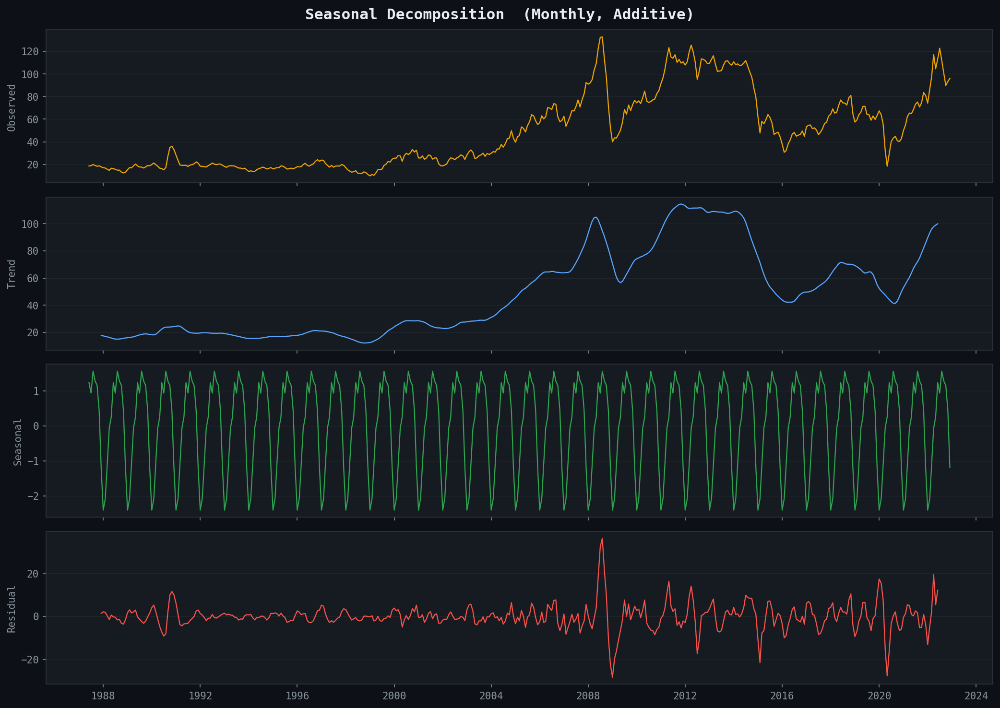
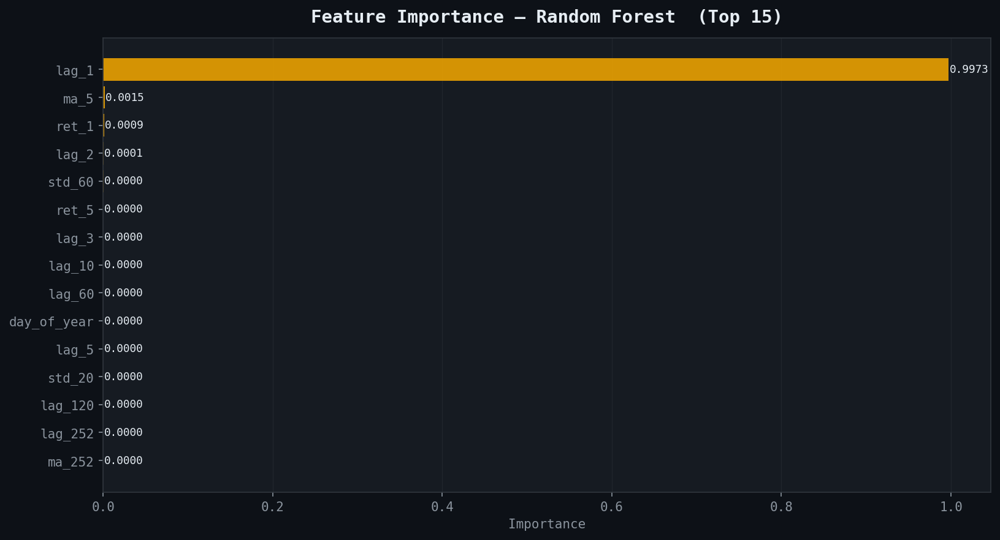
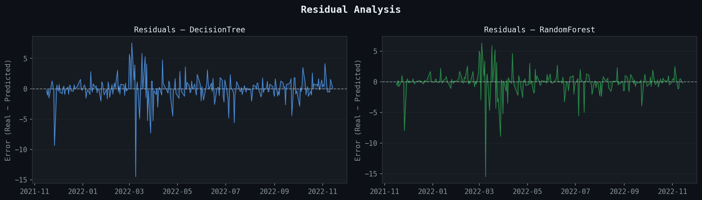

# 🛢️ Brent Crude Oil Price Forecasting
### Time Series Analysis | Decision Tree vs Random Forest | MLOps-ready

<p align="center">
  
</p>

---

## 📌 Overview

End-to-end time series forecasting project for **Brent Crude Oil prices** (1987–2022),
applying rigorous ML methodology: no data leakage, proper walk-forward validation,
and full model interpretability.

| | |
|---|---|
| **Dataset** | Brent Oil Prices — 9,011 daily observations (1987–2022) |
| **Models** | Decision Tree (baseline) · Random Forest (ensemble) |
| **Best MAPE** | ~0.95% (Random Forest) |
| **Tech Stack** | Python · scikit-learn · statsmodels · pandas · matplotlib |

---

## 📁 Project Structure

```
brent-oil-forecast/
│
├── data/
│   └── BrentOilPrices.csv          # Raw dataset (EIA / Kaggle)
│
├── notebooks/
│   └── brent_oil_forecast.ipynb    # Full analysis notebook
│
├── src/
│   └── generate_images.py          # Standalone image generation script
│
├── images/                         # All output charts (auto-generated)
│   ├── 01_serie_completa.png
│   ├── 02_decomposicao.png
│   ├── 03_adf_test.png
│   ├── 04_train_test_split.png
│   ├── 05_predictions.png
│   ├── 06_metrics.png
│   ├── 07_feature_importance.png
│   └── 08_residuals.png
│
├── requirements.txt
└── README.md
```

---

## 📊 Results

<p align="center">
  
</p>

<p align="center">
  
</p>

| Model | MAE (USD/bbl) | RMSE (USD/bbl) | MAPE |
|---|---|---|---|
| Decision Tree | 1.228 | 2.048 | 1.21% |
| **Random Forest** | **0.985** | **1.922** | **0.95%** |

> MAPE < 1% is considered **excellent** for commodity price forecasting.

---

## 🔬 Methodology

### 1. Exploratory Analysis
- Full series plot with geopolitical event annotations
- Monthly seasonal decomposition (Additive STL)
- ADF stationarity test with rolling statistics

### 2. Feature Engineering (no data leakage)
```python
# Lag features — price memory
for lag in [1, 2, 3, 5, 10, 20, 60, 120, 252]:
    df[f'lag_{lag}'] = df['Price'].shift(lag)

# Rolling stats — shift(1) before rolling to avoid leakage
df['ma_20']  = df['Price'].shift(1).rolling(20).mean()
df['std_20'] = df['Price'].shift(1).rolling(20).std()

# Returns — stationarises the signal
df['ret_1'] = df['Price'].pct_change(1)
```

### 3. Walk-Forward Validation
```
Train ──────────────────────────── | Test ── →
1988                             2021      2022
                                  (252 days)
```

### 4. Cross-Validation
```python
tscv = TimeSeriesSplit(n_splits=5)
gs   = GridSearchCV(model, param_grid, cv=tscv, scoring='neg_mean_absolute_error')
```

---

## 🖼️ Visual Analysis

<p align="center">
  
</p>

<p align="center">
  
</p>

<p align="center">
  
</p>

---

## 🚀 Quick Start

```bash
# Clone the repo
git clone https://github.com/YOUR_USERNAME/brent-oil-forecast.git
cd brent-oil-forecast

# Install dependencies
pip install -r requirements.txt

# Open notebook
jupyter notebook notebooks/brent_oil_forecast.ipynb

# Or regenerate all images
python src/generate_images.py
```

---

## 🗺️ MLOps Roadmap

- [x] Feature engineering pipeline (no leakage)
- [x] TimeSeriesSplit cross-validation
- [x] GridSearchCV hyperparameter tuning
- [x] Residual analysis & model diagnostics
- [ ] `joblib` model serialisation (`model.pkl`)
- [ ] `MLflow` experiment tracking
- [ ] `FastAPI` REST endpoint (`/predict`)
- [ ] `Docker` containerisation
- [ ] Scheduled retraining with `Apache Airflow`
- [ ] Data drift monitoring with `Evidently`

---

## 👤 Author

**[Teu Nome]**  
Data Scientist & AI Engineer | Founder @ [YellowGest](http://www.yellowgest.com)

[](https://linkedin.com/in/YOUR_PROFILE)
[](https://github.com/YOUR_USERNAME)

---

*Part of a LinkedIn article series on Time Series & Machine Learning.*  
*Read the full article → [LinkedIn Article Link]*
